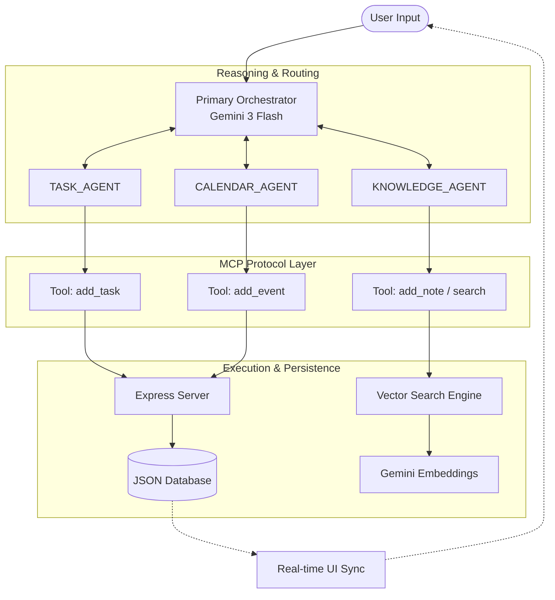

# Architecture Deep Dive: AgentFlow

**AgentFlow** implements a high-performance **Multi-Agent Orchestration** system designed for the Google AI Hackathon. This document explains the technical design and control flow.

## 🗺️ System Architecture Diagram

### Mermaid Visualization


### ASCII Architecture
```text
+-------------------------------------------------------------+
|                        USER INPUT                           |
+------------------------------+------------------------------+
                               |
                               v
+-------------------------------------------------------------+
|             PRIMARY ORCHESTRATOR (Gemini 3 Flash)           |
|         (Intent Parsing, Routing, Multi-Turn Reasoning)     |
+-------+----------------------+----------------------+-------+
        |                      |                      |
        v                      v                      v
+---------------+      +----------------+      +----------------+
|  TASK_AGENT   |      | CALENDAR_AGENT |      | KNOWLEDGE_AGENT|
+-------+-------+      +-------+--------+      +-------+--------+
        |                      |                       |
        |           MCP PROTOCOL LAYER (Tools)         |
        +----------------------+-----------------------+
                               |
                               v
+------------------------------+------------------------------+
|                INFRASTRUCTURE & PERSISTENCE                 |
|  (Express Server, JSON Database, Gemini Vector Search)      |
+-------------------------------------------------------------+
```

## 🧠 System Overview

The system is built on four distinct layers that separate high-level reasoning from low-level execution.

### 1. The Intelligence Layer (Gemini 3 Flash)
At the heart of AgentFlow is **Gemini 3 Flash**, chosen for its exceptional speed and reasoning capabilities. It acts as the **Primary Orchestrator**, responsible for:
- **Intent Parsing**: Analyzing natural language to determine user goals.
- **Agent Routing**: Selecting the appropriate specialized sub-agent (Task, Calendar, or Knowledge).
- **Multi-Turn Reasoning**: Maintaining a feedback loop where tool outputs inform subsequent decisions.

### 2. The Protocol Layer (Model Context Protocol - MCP)
We use the **MCP Pattern** to standardize how agents interact with tools.
- **Decoupling**: Reasoning happens in the LLM, but execution happens in deterministic code.
- **JSON-Schema Tools**: Every tool (e.g., `add_task`, `semantic_search`) is defined with a strict schema, preventing hallucinations and ensuring valid data mutations.
- **Traceability**: Every tool call is logged in the "MCP Tool Trace" for transparency.

### 3. The Execution Layer (Sub-Agents)
Specialized agents handle domain-specific logic:
- **TASK_AGENT**: Manages the state of the to-do list.
- **CALENDAR_AGENT**: Handles temporal logic and date/time calculations.
- **KNOWLEDGE_AGENT**: Interfaces with the vector search engine for RAG.

### 4. The Persistence Layer (Hybrid Storage)
- **Deterministic Core**: An Express server managing a JSON database for structured state (Tasks, Events).
- **Vector Engine**: Uses **Gemini Embeddings** (`gemini-embedding-2-preview`) to index and retrieve unstructured notes based on conceptual similarity.

---

## 🔄 Control & Data Flow

1. **User Input**: A natural language request is sent to the Orchestrator.
2. **Reasoning (Control Flow)**: The Orchestrator identifies the intent and invokes a sub-agent.
3. **Execution (Data Flow)**: The sub-agent calls a tool via the MCP protocol.
4. **Feedback Loop**: The tool result is returned to the Orchestrator. If the goal isn't met (e.g., a calendar conflict was found), the Orchestrator reasons again.
5. **Final Sync**: Once the goal is achieved, the state is persisted to the database, and the UI updates via a real-time state sync.

---

## 🚀 Hackathon Track Alignment

- **Track 1 (ADK/A2A)**: Implements a standardized `manifest.json` and a production-ready `/api/health` endpoint for agent discovery.
- **Track 2 (MCP)**: Uses a decoupled reasoning/execution loop with standardized tool protocols.
- **Track 3 (Vector Search)**: Implements a full RAG pipeline using Gemini Embeddings for semantic note retrieval.
