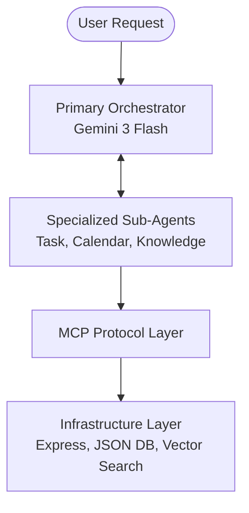

# AgentFlow: Multi-Track AI Agent System

**AgentFlow** is a sophisticated AI productivity system built for the **Google AI Hackathon**. It demonstrates a robust **Multi-Agent Architecture** that seamlessly integrates **ADK/A2A**, **Vector Search**, and **MCP** tracks into a single, production-ready application.

## 🚀 Hackathon Track Alignment

### 1. Track 1: Agent Development Kit (ADK) & A2A
- **Standardized Manifest**: Includes an `agent-card.json` (manifest) describing capabilities, making the system **Agent2Agent (A2A)** ready for discovery.
- **Primary Orchestrator**: Implements a central reasoning agent using **Gemini 3 Flash** that coordinates specialized sub-agent logic.
- **Production-Ready Backend**: Features a dedicated `/api/health` endpoint and structured API routes designed for serverless deployment on **Cloud Run**.

### 2. Track 3: AI-Enabled Data & Vector Search
- **Semantic Retrieval (RAG)**: Implements **Semantic Search** over unstructured notes using **Gemini Embeddings** (`gemini-embedding-2-preview`).
- **Conceptual Querying**: Users can query information using concepts rather than just keywords (e.g., *"Find my work-related notes"*).
- **Hybrid Storage**: Combines a deterministic JSON database for state with a vector-based retrieval system for knowledge.

### 3. Track 2: Model Context Protocol (MCP)
- **Separation of Reasoning & Execution**: Uses the **MCP Pattern** to decouple AI decision-making from deterministic tool execution.
- **Multi-Turn Tool Loop**: The orchestrator supports a **Feedback Loop** where sub-agents can perform multi-step reasoning (e.g., checking a schedule *before* booking an event) in a single user turn.
- **Standardized Tooling**: Tools for **Tasks**, **Calendar**, and **Notes** are integrated via strict JSON-Schema function declarations.

## 🧠 Advanced Features

- **Timezone Awareness**: The system automatically detects the user's local timezone and instructs agents to schedule events with the correct UTC offset, ensuring perfect synchronization between the AI and the UI.
- **Multi-Agent Orchestration**: A specialized routing layer analyzes user intent and invokes only the necessary agents (Task, Calendar, or Knowledge) to minimize latency and maximize accuracy.
- **Interactive Architecture Diagram**: A built-in system design viewer that visualizes the control flow (Reasoning) and data flow (Execution) from user intent to data persistence.
- **Mobile-Friendly UI**: Fully responsive dashboard and architecture visualization optimized for all screen sizes.
- **MCP Protocol Layer**: A standardized middleware that translates high-level agent intents into low-level database operations.

## 🗺️ System Architecture



## 📂 Project Structure

```text
├── ui/                 # React Frontend (Vite Root)
│   ├── agent/          # Orchestrator Agent (Multi-Turn Reasoning)
│   ├── mcp/            # MCP Tool Definitions (Capability Layer)
│   └── App.tsx         # Dashboard & Architecture Visualization
├── backend/            # Express Server (Execution & Data Layer)
│   ├── index.ts        # API Routes, Health, & Manifest
│   └── db/             # JSON Database Module
├── manifest.json       # Agent Card for A2A Discovery
└── vite.config.ts      # Full-Stack Configuration
```

## ⚙️ Setup & Installation

> [!IMPORTANT]
> **Gemini API Key Required**: This application requires a valid Gemini API key to function. The orchestrator uses `gemini-3-flash-preview` and the knowledge engine uses `gemini-embedding-2-preview`.

1. **Environment Variables**:
   Set your `GEMINI_API_KEY` in your environment.
   ```env
   GEMINI_API_KEY=your_api_key_here
   ```

2. **Install & Run**:
   ```bash
   npm install
   npm run dev
   ```

## 💡 How to Demo

1. **Multi-Step Workflow**: Try: *"Finish the design docs (high priority), schedule a kickoff meeting tomorrow at 9 AM, and note that the project code is 'Project-X'."*
2. **Conflict Checking**: Try: *"Schedule a 'Design Review' for tomorrow at 10 AM. Do I have anything else going on then? If not, go ahead and schedule it."*
3. **Semantic Search**: Try: *"Find my notes about project deadlines"* (even if the word 'deadline' isn't in the note, the semantic engine will find relevant content).
4. **Architecture Verification**: Check the **Architecture** tab for the full system design and control flow visualization.

## 📖 Documentation
- [**Architecture Deep Dive**](./ARCHITECTURE.md): Technical design, control flow, and track alignment.
- [**Deployment Guide**](./DEPLOYMENT.md): Instructions for Cloud Run and local setup.

## ⚖️ Jury Quick Start: Example Conversations

To experience the full reasoning power of AgentFlow, try these multi-turn conversations:

### 1. Multi-Agent Coordination (Track 1 & 2)
> **Prompt:** *"I need to finish the project proposal by Friday. Add it as a high priority task, and then schedule a 1-hour review meeting for this Thursday at 10 AM. Check if I'm free first!"*
> 
> **What to look for:** The agent will first add the task, then check your calendar for conflicts, and finally schedule the meeting—all in one go. Check the **MCP Tool Trace** to see the parallel agent execution.

### 2. Semantic Reasoning & RAG (Track 3)
> **Prompt:** *"Add a note: 'The secret code for the vault is 12345'. Then, a few minutes later, ask: 'What was that security information I saved earlier?'"*
> 
> **What to look for:** The agent will use **Vector Search** to find the note based on the *concept* of "security information," even though the word "security" wasn't in the original note.

### 3. Conflict Resolution & Logic
> **Prompt:** *"Schedule a 'Sync' for tomorrow at 3 PM. Oh wait, if I already have something at 3 PM, move the new sync to 4 PM instead."*
> 
> **What to look for:** The agent will perform a conditional check on your existing schedule before deciding which tool parameters to use.

---
*Built for the Google AI Hackathon - Demonstrating the power of Multi-Agent Coordination, MCP, and Vector Search.*
